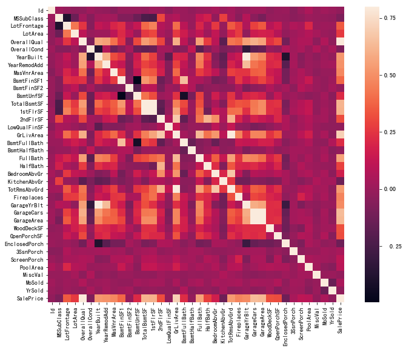
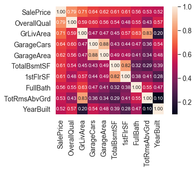
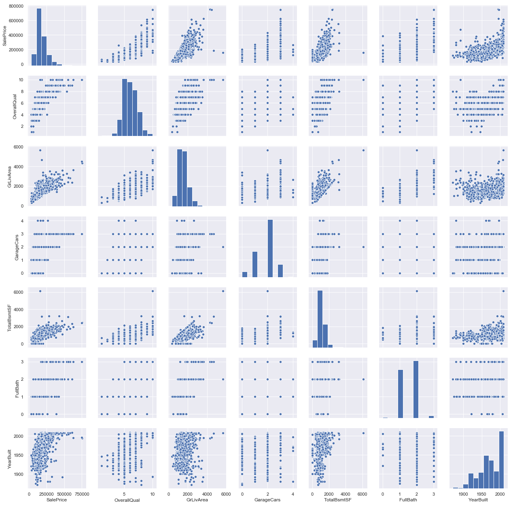
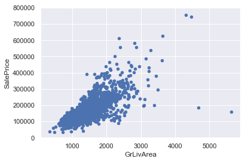
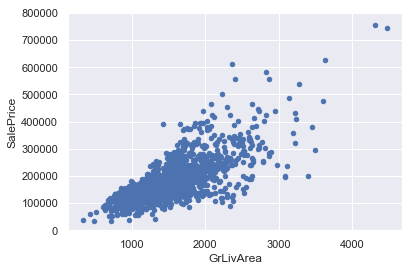

```python
import pandas as pd
import matplotlib.pyplot as plt
import seaborn as sns
import numpy as np
from scipy.stats import norm
from sklearn.preprocessing import StandardScaler
from scipy import stats
import warnings
warnings.filterwarnings('ignore')
%matplotlib inline
```


```python
train = pd.read_csv('input/train.csv')
test = pd.read_csv('input/test.csv')
sample = pd.read_csv('input/sample_submission.csv')
```


```python
corrmat = train.corr()
f, ax = plt.subplots(figsize=(12, 9))
sns.heatmap(corrmat, vmax=.8, square=True)
```


    <matplotlib.axes._subplots.AxesSubplot at 0x12505f748>





```python
k = 10
cols = corrmat.nlargest(k, 'SalePrice')['SalePrice'].index
cm = np.corrcoef(train[cols].values.T)
sns.set(font_scale=1.25)
hm = sns.heatmap(cm, cbar=True, annot=True, square=True, fmt='.2f', annot_kws={'size': 10}, 
                 yticklabels=cols.values, xticklabels=cols.values)
plt.show()
```





```python
sns.set()
cols = ['SalePrice', 'OverallQual', 'GrLivArea', 'GarageCars', 'TotalBsmtSF', 'FullBath', 'YearBuilt']
sns.pairplot(train[cols], size = 2.5)
plt.show()
```





```python
train_Id = train['Id']
test_Id = test['Id']
len_train = train.shape[0]
len_test = test.shape[0]
```


```python
housing = pd.concat([train, test], sort=False)
```


```python
housing.shape
```


    (2919, 81)


```python
housing[cols].columns
```


    Index(['SalePrice', 'OverallQual', 'GrLivArea', 'GarageCars', 'TotalBsmtSF',
           'FullBath', 'YearBuilt'],
          dtype='object')


```python
housing = housing[cols]
```


```python
housing.isnull().sum()
```


    SalePrice      1459
    OverallQual       0
    GrLivArea         0
    GarageCars        1
    TotalBsmtSF       1
    FullBath          0
    YearBuilt         0
    dtype: int64


```python
housing.GarageCars = housing.GarageCars.fillna(housing.GarageCars.mean())
```


```python
housing.TotalBsmtSF = housing.TotalBsmtSF.fillna(housing.TotalBsmtSF.mean())
```


```python
train = housing[:len_train]
test = housing[len_train:]
```


```python
xtrain=train.drop("SalePrice",axis=1)
ytrain=train['SalePrice']
xtest=test.drop("SalePrice", axis=1)
```


```python
from math import sqrt
train_X, val_X, train_y, val_y = train_test_split(xtrain, ytrain, random_state=1)

# 3 建模讯模
my_pipeline = XGBRegressor(n_estimators=1000, learning_rate=0.05)
my_pipeline.fit(train_X, train_y)

# 4 误差验证
val_preds = my_pipeline.predict(val_X)
msel = mean_squared_error(np.log(val_preds), np.log(val_y))
print("RMSE: %2f" %sqrt(msel))
```

    RMSE: 0.173459


```python
test_preds = my_pipeline.predict(xtest)

# 7 预测结果导出
output = pd.DataFrame({
	'Id': test_Id,
	'SalePrice': test_preds
	})
output.set_index('Id').to_csv('submission.csv')
```


```python
var = 'GrLivArea'
data = pd.concat([train['SalePrice'], train[var]], axis=1)
data.plot.scatter(x=var, y='SalePrice', ylim=(0,800000));
```

    'c' argument looks like a single numeric RGB or RGBA sequence, which should be avoided as value-mapping will have precedence in case its length matches with 'x' & 'y'.  Please use a 2-D array with a single row if you really want to specify the same RGB or RGBA value for all points.





```python
train.sort_values(by = 'GrLivArea', ascending = False)[:2]
```


<div>
<style scoped>
    .dataframe tbody tr th:only-of-type {
        vertical-align: middle;
    }

    .dataframe tbody tr th {
        vertical-align: top;
    }

    .dataframe thead th {
        text-align: right;
    }
</style>
<table border="1" class="dataframe">
  <thead>
    <tr style="text-align: right;">
      <th></th>
      <th>SalePrice</th>
      <th>OverallQual</th>
      <th>GrLivArea</th>
      <th>GarageCars</th>
      <th>TotalBsmtSF</th>
      <th>FullBath</th>
      <th>YearBuilt</th>
    </tr>
  </thead>
  <tbody>
    <tr>
      <th>1298</th>
      <td>160000.0</td>
      <td>10</td>
      <td>5642</td>
      <td>2.0</td>
      <td>6110.0</td>
      <td>2</td>
      <td>2008</td>
    </tr>
    <tr>
      <th>523</th>
      <td>184750.0</td>
      <td>10</td>
      <td>4676</td>
      <td>3.0</td>
      <td>3138.0</td>
      <td>3</td>
      <td>2007</td>
    </tr>
  </tbody>
</table>
</div>


```python
train = train.drop(train[train.index == 1298].index)
train = train.drop(train[train.index == 523].index)
```


```python
var = 'GrLivArea'
data = pd.concat([train['SalePrice'], train[var]], axis=1)
data.plot.scatter(x=var, y='SalePrice', ylim=(0,800000));
```

    'c' argument looks like a single numeric RGB or RGBA sequence, which should be avoided as value-mapping will have precedence in case its length matches with 'x' & 'y'.  Please use a 2-D array with a single row if you really want to specify the same RGB or RGBA value for all points.





```python
xtrain=train.drop("SalePrice",axis=1)
ytrain=train['SalePrice']
xtest=test.drop("SalePrice", axis=1)
```


```python
from math import sqrt
train_X, val_X, train_y, val_y = train_test_split(xtrain, ytrain, random_state=1)

# 3 建模讯模
my_pipeline = XGBRegressor(n_estimators=1000, learning_rate=0.05)
my_pipeline.fit(train_X, train_y)

# 4 误差验证
val_preds = my_pipeline.predict(val_X)
msel = mean_squared_error(np.log(val_preds), np.log(val_y))
print("RMSE: %2f" %sqrt(msel))
```

    RMSE: 0.162534


```python
test_preds = my_pipeline.predict(xtest)

# 7 预测结果导出
output = pd.DataFrame({
	'Id': test_Id,
	'SalePrice': test_preds
	})
output.set_index('Id').to_csv('submission2.csv')
```


```python

```
