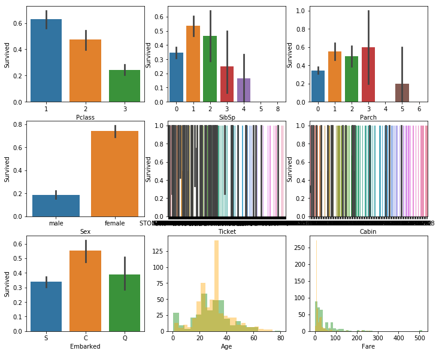
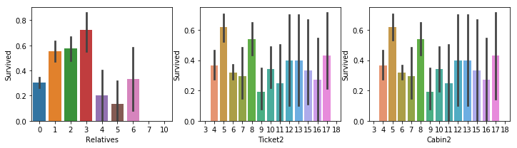

```python
import pandas as pd
import numpy as np
from math import sqrt
from xgboost import XGBRegressor
from sklearn.pipeline import make_pipeline
from sklearn.preprocessing import Imputer
from sklearn.model_selection import train_test_split
from sklearn.model_selection import cross_val_score
from sklearn.metrics import accuracy_score
```


```python
train = pd.read_csv('input/train.csv')
test = pd.read_csv('input/test.csv')
test2 = pd.read_csv('input/test.csv')
titanic = pd.concat([train, test], sort=False)
len_train = train.shape[0]
```


```python
titanic.dtypes.sort_values()
```


    PassengerId      int64
    Pclass           int64
    SibSp            int64
    Parch            int64
    Survived       float64
    Age            float64
    Fare           float64
    Name            object
    Sex             object
    Ticket          object
    Cabin           object
    Embarked        object
    dtype: object


```python
titanic.select_dtypes(include='int').head()
```


<div>
<style scoped>
    .dataframe tbody tr th:only-of-type {
        vertical-align: middle;
    }

    .dataframe tbody tr th {
        vertical-align: top;
    }

    .dataframe thead th {
        text-align: right;
    }
</style>
<table border="1" class="dataframe">
  <thead>
    <tr style="text-align: right;">
      <th></th>
      <th>PassengerId</th>
      <th>Pclass</th>
      <th>SibSp</th>
      <th>Parch</th>
    </tr>
  </thead>
  <tbody>
    <tr>
      <th>0</th>
      <td>1</td>
      <td>3</td>
      <td>1</td>
      <td>0</td>
    </tr>
    <tr>
      <th>1</th>
      <td>2</td>
      <td>1</td>
      <td>1</td>
      <td>0</td>
    </tr>
    <tr>
      <th>2</th>
      <td>3</td>
      <td>3</td>
      <td>0</td>
      <td>0</td>
    </tr>
    <tr>
      <th>3</th>
      <td>4</td>
      <td>1</td>
      <td>1</td>
      <td>0</td>
    </tr>
    <tr>
      <th>4</th>
      <td>5</td>
      <td>3</td>
      <td>0</td>
      <td>0</td>
    </tr>
  </tbody>
</table>
</div>


```python
titanic.select_dtypes(include='float').head()
```


<div>
<style scoped>
    .dataframe tbody tr th:only-of-type {
        vertical-align: middle;
    }

    .dataframe tbody tr th {
        vertical-align: top;
    }

    .dataframe thead th {
        text-align: right;
    }
</style>
<table border="1" class="dataframe">
  <thead>
    <tr style="text-align: right;">
      <th></th>
      <th>Survived</th>
      <th>Age</th>
      <th>Fare</th>
    </tr>
  </thead>
  <tbody>
    <tr>
      <th>0</th>
      <td>0.0</td>
      <td>22.0</td>
      <td>7.2500</td>
    </tr>
    <tr>
      <th>1</th>
      <td>1.0</td>
      <td>38.0</td>
      <td>71.2833</td>
    </tr>
    <tr>
      <th>2</th>
      <td>1.0</td>
      <td>26.0</td>
      <td>7.9250</td>
    </tr>
    <tr>
      <th>3</th>
      <td>1.0</td>
      <td>35.0</td>
      <td>53.1000</td>
    </tr>
    <tr>
      <th>4</th>
      <td>0.0</td>
      <td>35.0</td>
      <td>8.0500</td>
    </tr>
  </tbody>
</table>
</div>


处理缺失值


```python
titanic.isnull().sum()[titanic.isnull().sum()>0]
```


    Survived     418
    Age          263
    Fare           1
    Cabin       1014
    Embarked       2
    dtype: int64


```python
train.Fare = train.Fare.fillna(train.Fare.mean())
test.Fare = test.Fare.fillna(train.Fare.mean())
```


```python
train.Cabin = train.Cabin.fillna('unknow')
test.Cabin = test.Cabin.fillna('unknow')
```


```python
train.Embarked=train.Embarked.fillna(train.Embarked.mode()[0])
test.Embarked=test.Embarked.fillna(train.Embarked.mode()[0])
#mode方法为求众数（频数最高的值）
```


```python
a = train.Name[0]
```


```python
a
```


    'Braund, Mr. Owen Harris'


```python
a.split('.')[0].split(',')[1].strip()
```


    'Mr'


```python
train['title'] = train.Name.apply(lambda x: x.split('.')[0].split(',')[1].strip())
test['title'] = test.Name.apply(lambda x: x.split('.')[0].split(',')[1].strip())
```


```python
train.title.value_counts()
```


    Mr              517
    Miss            182
    Mrs             125
    Master           40
    Dr                7
    Rev               6
    Mlle              2
    Major             2
    Col               2
    Jonkheer          1
    Lady              1
    Ms                1
    Capt              1
    the Countess      1
    Mme               1
    Don               1
    Sir               1
    Name: title, dtype: int64


```python
newtitles={
    "Capt":        "Officer",
    "Col":         "Officer",
    "Major":       "Officer",
    "Jonkheer":    "Royalty",
    "Don":         "Royalty",
    "Sir":         "Royalty",
    "Dr":          "Officer",
    "Rev":         "Officer",
    "the Countess":"Royalty",
    "Dona":        "Royalty",
    "Mme":         "Mrs",
    "Mlle":        "Miss",
    "Ms":          "Mrs",
    "Mr":          "Mr",
    "Mrs":         "Mrs",
    "Miss":        "Miss",
    "Master":      "Master",
    "Lady":        "Royalty"
}
```


```python
train['title'] = train.title.map(newtitles)
test['title'] = test.title.map(newtitles)
```


```python
train.groupby(['title', 'Sex']).Age.mean()
```


    title    Sex   
    Master   male       4.574167
    Miss     female    21.804054
    Mr       male      32.368090
    Mrs      female    35.718182
    Officer  female    49.000000
             male      46.562500
    Royalty  female    40.500000
             male      42.333333
    Name: Age, dtype: float64


```python
def newage(cols):
    title=cols[0]
    Sex=cols[1]
    Age=cols[2]
    if pd.isnull(Age):
        if title=='Master' and Sex=='male':
            return 4.57
        elif title=='Miss' and Sex=='female':
            return 21.8
        elif title=='Mr' and Sex=='male':
            return 32.37
        elif title=='Mrs' and Sex=='female':
            return 35.72
        elif title=='Officer' and Sex=='female':
            return 49
        elif title=='Officer' and Sex=='male':
            return 46.56
        elif title=='Royalty' and Sex=='female':
            return 40.5
        elif title=='Royalty' and Sex=='male':
            return 42.33
    else:
        return Age
```


```python
train.Age = train[['title', 'Sex', 'Age']].apply(newage, axis=1)
test.Age = test[['title', 'Sex', 'Age']].apply(newage, axis=1)
```

数据探索


```python
import warnings
warnings.filterwarnings(action="ignore")
```


```python
import matplotlib.pyplot as plt
import seaborn as sns
```


```python
plt.figure(figsize=[12, 10])
plt.subplot(3,3,1)
sns.barplot('Pclass', 'Survived', data=train)
plt.subplot(3,3,2)
sns.barplot('SibSp', 'Survived', data=train)
plt.subplot(3,3,3)
sns.barplot('Parch', 'Survived', data=train)
plt.subplot(3,3,4)
sns.barplot('Sex', 'Survived', data=train)
plt.subplot(3,3,5)
sns.barplot('Ticket', 'Survived', data=train)
plt.subplot(3,3,6)
sns.barplot('Cabin', 'Survived', data=train)
plt.subplot(3,3,7)
sns.barplot('Embarked', 'Survived', data=train)
plt.subplot(3,3,8)
sns.distplot(train[train.Survived==1].Age, color='green', kde=False)
sns.distplot(train[train.Survived==0].Age, color='orange', kde=False)
plt.subplot(3,3,9)
sns.distplot(train[train.Survived==1].Fare, color='green', kde=False)
sns.distplot(train[train.Survived==0].Fare, color='orange', kde=False)
```


    <matplotlib.axes._subplots.AxesSubplot at 0x120a26b00>





特征工程


```python
train['Relatives'] = train.SibSp + train.Parch
test['Relatives'] = test.SibSp + test.Parch
```


```python
train['Ticket2'] = train.Ticket.apply(lambda x: len(x))
test['Ticket2'] = test.Ticket.apply(lambda x: len(x))
```


```python
train['Cabin2'] = train.Ticket.apply(lambda x: len(x))
test['Cabin2'] = test.Ticket.apply(lambda x: len(x))
```


```python
train['Name2'] = train.Name.apply(lambda x: x.split(',')[0].strip())
test['Name2'] = test.Name.apply(lambda x: x.split(',')[0].strip())
```


```python
plt.figure(figsize=[12, 10])
plt.subplot(3,3,1)
sns.barplot('Relatives', 'Survived', data=train)
plt.subplot(3,3,2)
sns.barplot('Ticket2', 'Survived', data=train)
plt.subplot(3,3,3)
sns.barplot('Cabin2', 'Survived', data=train)
```


    <matplotlib.axes._subplots.AxesSubplot at 0x1233aad30>





数据准备


```python
train.drop(['PassengerId', 'Name', 'Ticket', 'SibSp', 'Parch', 'Ticket', 'Cabin'], axis=1, inplace=True)
test.drop(['PassengerId', 'Name', 'Ticket', 'SibSp', 'Parch', 'Ticket', 'Cabin'], axis=1, inplace=True)
```


```python
titanic = pd.concat([train, test], sort=False)
```


```python
titanic = pd.get_dummies(titanic)
```


```python
train = titanic[:len_train]
test = titanic[len_train:]
```


```python
train.Survived.dtype
```


    dtype('float64')


```python
train.Survived = train.Survived.astype('int')
```


```python
train.Survived.dtype
```


    dtype('int64')


```python
y = train.Survived
X = train.drop('Survived', axis=1)
```


```python
train_X, val_X, train_y, val_y = train_test_split(X, y, random_state=1)

# 3 建模讯模
my_pipeline = make_pipeline(Imputer(), XGBRegressor(n_estimators=1000, learning_rate=0.05))
my_pipeline.fit(train_X, train_y)
# 4 误差验证
val_preds = my_pipeline.predict(val_X)
val_pre = [int(item>0.5) for  item in val_preds]
score = accuracy_score(val_pre, val_y)
print("Accuracy: %2f" %score)
```

    Accuracy: 0.829596


```python
xtest = test.drop("Survived", axis=1)
```


```python
pred = my_pipeline.predict(xtest)
```


```python
output = pd.DataFrame({'PassengerId': test2['PassengerId'], 'Survived': pred})
```


```python
output.to_csv('submission.csv', index=False)
```


```python
pre = [int(item>0.5) for  item in pred]
```


```python
output2 = pd.DataFrame({'PassengerId': test2['PassengerId'], 'Survived': pre})
```


```python
from sklearn.preprocessing import StandardScaler
from sklearn.svm import SVC
from sklearn.model_selection import GridSearchCV

svc=make_pipeline(StandardScaler(),SVC(random_state=1))
r=[0.0001,0.001,0.1,1,10,50,100]
PSVM=[{'svc__C':r, 'svc__kernel':['linear']},
      {'svc__C':r, 'svc__gamma':r, 'svc__kernel':['rbf']}]
GSSVM=GridSearchCV(estimator=svc, param_grid=PSVM, scoring='accuracy', cv=2)
scores_svm=cross_val_score(GSSVM, X.astype(float), y,scoring='accuracy', cv=5)
```


```python
np.mean(scores_svm)
```


    0.8439879324218461


```python
warnings.filterwarnings(action="ignore")
model=GSSVM.fit(X, y)
pred=model.predict(xtest)
output=pd.DataFrame({'PassengerId':test2['PassengerId'],'Survived':pred})
output.to_csv('submission.csv', index=False)
```


```python

```
