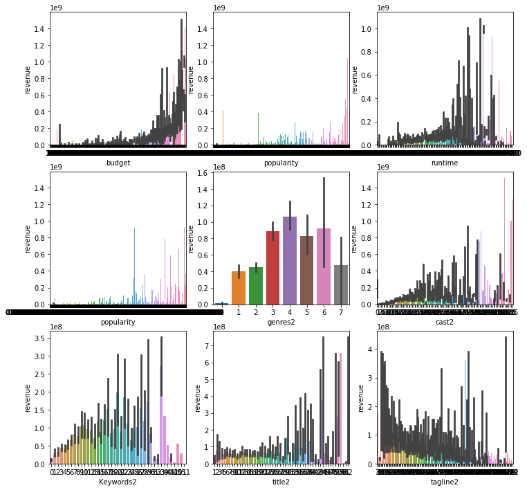
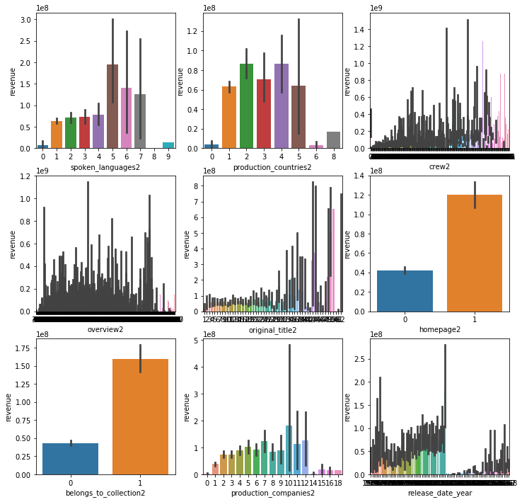
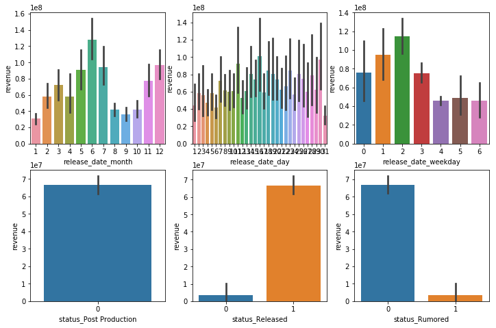
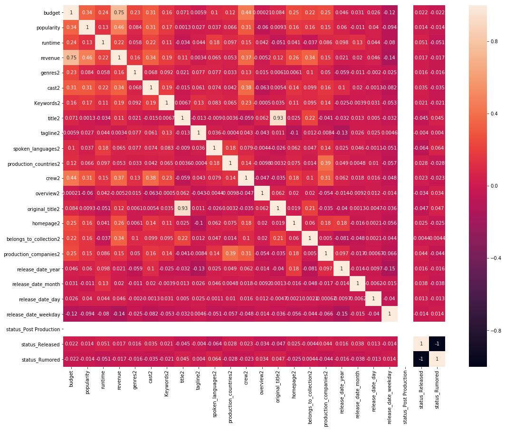

```python
import pandas as pd
import numpy as np
import seaborn as sns
import matplotlib.pyplot as plt
import warnings

from sklearn.model_selection import train_test_split
from sklearn.metrics import mean_squared_log_error
from xgboost import XGBRegressor
from math import sqrt

train = pd.read_csv('input/train.csv')
test = pd.read_csv('input/test.csv')
sample = pd.read_csv('input/sample_submission.csv')
```


```python
tmdb = pd.concat([train, test]) 
```

    d:\python\python36\lib\site-packages\ipykernel_launcher.py:1: FutureWarning: Sorting because non-concatenation axis is not aligned. A future version
    of pandas will change to not sort by default.
    
    To accept the future behavior, pass 'sort=False'.
    
    To retain the current behavior and silence the warning, pass 'sort=True'.
    
      """Entry point for launching an IPython kernel.
    


```python
tmdb.dtypes.sort_values()
```


    budget                     int64
    id                         int64
    runtime                  float64
    revenue                  float64
    popularity               float64
    Keywords                  object
    status                    object
    spoken_languages          object
    release_date              object
    production_countries      object
    production_companies      object
    poster_path               object
    overview                  object
    original_title            object
    original_language         object
    imdb_id                   object
    homepage                  object
    genres                    object
    crew                      object
    cast                      object
    belongs_to_collection     object
    tagline                   object
    title                     object
    dtype: object


```python
tmdb.isnull().sum()[tmdb.isnull().sum()>0]
```


    Keywords                  669
    belongs_to_collection    5917
    cast                       26
    crew                       38
    genres                     23
    homepage                 5032
    overview                   22
    poster_path                 2
    production_companies      414
    production_countries      157
    release_date                1
    revenue                  4398
    runtime                     6
    spoken_languages           62
    status                      2
    tagline                  1460
    title                       3
    dtype: int64


```python
train.belongs_to_collection = train.belongs_to_collection.fillna("unknow")
test.belongs_to_collection = test.belongs_to_collection.fillna("unknow")

train.genres = train.genres.fillna("unknow")
test.genres = test.genres.fillna("unknow")

train.homepage = train.homepage.fillna("unknow")
test.homepage = test.homepage.fillna("unknow")

train.overview = train.overview.fillna("unknow")
test.overview = test.overview.fillna("unknow")

train.poster_path = train.poster_path.fillna("unknow")
test.poster_path = test.poster_path.fillna("unknow")

train.production_companies = train.production_companies.fillna("unknow")
test.production_companies = test.production_companies.fillna("unknow")

train.production_countries = train.production_countries.fillna("unknow")
test.production_countries = test.production_countries.fillna("unknow")

train.runtime = train.runtime.fillna(train.runtime.mean())
test.runtime = test.runtime.fillna(train.runtime.mean())

train.spoken_languages = train.spoken_languages.fillna("unknow")
test.spoken_languages = test.spoken_languages.fillna("unknow")

train.tagline = train.tagline.fillna("unknow")
test.tagline = test.tagline.fillna("unknow")

train.Keywords = train.Keywords.fillna("unknow")
test.Keywords = test.Keywords.fillna("unknow")

train.cast = train.cast.fillna("unknow")
test.cast = test.cast.fillna("unknow")

train.crew = train.crew.fillna("unknow")
test.crew = test.crew.fillna("unknow")

train.title = train.title.fillna("unknow")
test.title = test.title.fillna("unknow")

train.status = train.status.fillna(train.status.mode())
test.status = test.status.fillna(train.status.mode())

train.release_date = train.release_date.fillna("unknow")
test.release_date = test.release_date.fillna("unknow")

test.release_date[test.release_date=="unknow"] = 0000-00-00
```

    d:\python\python36\lib\site-packages\ipykernel_launcher.py:49: SettingWithCopyWarning: 
    A value is trying to be set on a copy of a slice from a DataFrame
    
    See the caveats in the documentation: http://pandas.pydata.org/pandas-docs/stable/indexing.html#indexing-view-versus-copy
    


```python
train['genres2'] = train.genres.apply(lambda x: x.count('id'))
test['genres2'] = test.genres.apply(lambda x: x.count('id'))

train['cast2'] = train.cast.apply(lambda x: x.count('cast_id'))
test['cast2'] = test.cast.apply(lambda x: x.count('cast_id'))

train['Keywords2'] = train.Keywords.apply(lambda x: x.count('id'))
test['Keywords2'] = test.Keywords.apply(lambda x: x.count('id'))

train['title2'] = train.title.apply(lambda x: len(x))
test['title2'] = test.title.apply(lambda x: len(x))

train['tagline2'] = train.tagline.apply(lambda x: len(x))
test['tagline2'] = test.tagline.apply(lambda x: len(x))

train['spoken_languages2'] = train.spoken_languages.apply(lambda x: x.count('name'))
test['spoken_languages2'] = test.spoken_languages.apply(lambda x: x.count('name'))

train['production_countries2'] = train.production_countries.apply(lambda x: x.count('name'))
test['production_countries2'] = test.production_countries.apply(lambda x: x.count('name'))

train['crew2'] = train.crew.apply(lambda x: x.count('id'))
test['crew2'] = test.crew.apply(lambda x: x.count('id'))

train['overview2'] = train.overview.apply(lambda x: len(x))
test['overview2'] = test.overview.apply(lambda x: len(x))

train['original_title2'] = train.original_title.apply(lambda x: len(x))
test['original_title2'] = test.original_title.apply(lambda x: len(x))

train['homepage2'] = train.homepage.apply(lambda x: 0 if x=='unknow' else 1)
test['homepage2'] = test.homepage.apply(lambda x: 0 if x=='unknow' else 1)

train['belongs_to_collection2'] = train.belongs_to_collection.apply(lambda x: 0 if x=='unknow' else 1)
test['belongs_to_collection2'] = test.belongs_to_collection.apply(lambda x: 0 if x=='unknow' else 1)

train['production_companies2'] = train.production_companies.apply(lambda x: x.count('id'))
test['production_companies2'] = test.production_companies.apply(lambda x: x.count('id'))
```


```python
train['release_date_year'] = train.release_date.apply(lambda x: pd.to_datetime(x).year)
train['release_date_month'] = train.release_date.apply(lambda x: pd.to_datetime(x).month)
train['release_date_day'] = train.release_date.apply(lambda x: pd.to_datetime(x).day)
train['release_date_weekday'] = train.release_date.apply(lambda x: pd.to_datetime(x).weekday())
test['release_date_year'] = test.release_date.apply(lambda x: pd.to_datetime(x).year)
test['release_date_month'] = test.release_date.apply(lambda x: pd.to_datetime(x).month)
test['release_date_day'] = test.release_date.apply(lambda x: pd.to_datetime(x).day)
test['release_date_weekday'] = test.release_date.apply(lambda x: pd.to_datetime(x).weekday())
```


```python
train.drop(['id', 'belongs_to_collection', 'genres', 'homepage',
       'imdb_id', 'original_language', 'original_title', 'overview', 'poster_path', 'production_companies',
       'production_countries', 'release_date', 'spoken_languages' , 'tagline', 'title', 'Keywords', 'cast', 'crew'], axis=1, inplace=True)

test.drop(['id', 'belongs_to_collection', 'genres', 'homepage',
       'imdb_id', 'original_language', 'original_title', 'overview', 'poster_path', 'production_companies',
       'production_countries', 'release_date', 'spoken_languages' , 'tagline', 'title', 'Keywords', 'cast', 'crew'], axis=1, inplace=True)


tmdb = pd.concat([train, test], sort=False)
tmdb = pd.get_dummies(tmdb)
len_train = len(train)
len_test = len(test)
train = tmdb[:len_train]
test = tmdb[len_train:]

train.revenue = train.revenue.astype('int')

xtrain=train.drop("revenue", axis=1)
ytrain=train['revenue']
xtest=test.drop("revenue", axis=1)
```

    d:\python\python36\lib\site-packages\pandas\core\generic.py:5096: SettingWithCopyWarning: 
    A value is trying to be set on a copy of a slice from a DataFrame.
    Try using .loc[row_indexer,col_indexer] = value instead
    
    See the caveats in the documentation: http://pandas.pydata.org/pandas-docs/stable/indexing.html#indexing-view-versus-copy
      self[name] = value
    


```python
train.columns
```


    Index(['budget', 'popularity', 'runtime', 'revenue', 'genres2', 'cast2',
           'Keywords2', 'title2', 'tagline2', 'spoken_languages2',
           'production_countries2', 'crew2', 'overview2', 'original_title2',
           'homepage2', 'belongs_to_collection2', 'production_companies2',
           'release_date_year', 'release_date_month', 'release_date_day',
           'release_date_weekday', 'status_Post Production', 'status_Released',
           'status_Rumored'],
          dtype='object')


```python
plt.figure(figsize=[12, 12])
plt.subplot(3, 3, 1)
sns.barplot('budget', 'revenue', data=train)
plt.subplot(3, 3, 2)
sns.barplot('popularity', 'revenue', data=train)
plt.subplot(3, 3, 3)
sns.barplot('runtime', 'revenue', data=train)
plt.subplot(3, 3, 4)
sns.barplot('popularity', 'revenue', data=train)
plt.subplot(3, 3, 5)
sns.barplot('genres2', 'revenue', data=train)
plt.subplot(3, 3, 6)
sns.barplot('cast2', 'revenue', data=train)
plt.subplot(3, 3, 7)
sns.barplot('Keywords2', 'revenue', data=train)
plt.subplot(3, 3, 8)
sns.barplot('title2', 'revenue', data=train)
plt.subplot(3, 3, 9)
sns.barplot('tagline2', 'revenue', data=train)
```


    <matplotlib.axes._subplots.AxesSubplot at 0x19650563d30>





```python
plt.figure(figsize=[12, 12])
plt.subplot(3, 3, 1)
sns.barplot('spoken_languages2', 'revenue', data=train)
plt.subplot(3, 3, 2)
sns.barplot('production_countries2', 'revenue', data=train)
plt.subplot(3, 3, 3)
sns.barplot('crew2', 'revenue', data=train)
plt.subplot(3, 3, 4)
sns.barplot('overview2', 'revenue', data=train)
plt.subplot(3, 3, 5)
sns.barplot('original_title2', 'revenue', data=train)
plt.subplot(3, 3, 6)
sns.barplot('homepage2', 'revenue', data=train)
plt.subplot(3, 3, 7)
sns.barplot('belongs_to_collection2', 'revenue', data=train)
plt.subplot(3, 3, 8)
sns.barplot('production_companies2', 'revenue', data=train)
plt.subplot(3, 3, 9)
sns.barplot('release_date_year', 'revenue', data=train)
```


    <matplotlib.axes._subplots.AxesSubplot at 0x196598c4e48>





```python
plt.figure(figsize=[12, 12])
plt.subplot(3, 3, 1)
sns.barplot('release_date_month', 'revenue', data=train)
plt.subplot(3, 3, 2)
sns.barplot('release_date_day', 'revenue', data=train)
plt.subplot(3, 3, 3)
sns.barplot('release_date_weekday', 'revenue', data=train)
plt.subplot(3, 3, 4)
sns.barplot('status_Post Production', 'revenue', data=train)
plt.subplot(3, 3, 5)
sns.barplot('status_Released', 'revenue', data=train)
plt.subplot(3, 3, 6)
sns.barplot('status_Rumored', 'revenue', data=train)
```


    <matplotlib.axes._subplots.AxesSubplot at 0x1964aecc908>





```python
fig = plt.figure(figsize=(18,14))
sns.heatmap(train.corr(), annot=True)
```


    <matplotlib.axes._subplots.AxesSubplot at 0x1962e78dcf8>





```python
from sklearn import tree
model_tree = tree.DecisionTreeRegressor()

from sklearn import linear_model
model_lr = linear_model.LinearRegression()

from sklearn import svm
model_svr = svm.SVR()

from sklearn import neighbors
model_KN = neighbors.KNeighborsRegressor()

from sklearn import ensemble
model_RandomForestRegressor = ensemble.RandomForestRegressor(n_estimators=20)

from sklearn import ensemble
model_AdaBoostRegressor = ensemble.AdaBoostRegressor(n_estimators=50)

from sklearn import ensemble
model_GradientBoostingRegressor = ensemble.GradientBoostingRegressor(n_estimators=100)

from sklearn.ensemble import BaggingRegressor
model_BaggingRegressor = BaggingRegressor()

from sklearn.tree import ExtraTreeRegressor
model_ExtraTreeRegressor = ExtraTreeRegressor()

def try_model(model):
	model_name = str(model)
	train_X, val_X, train_y, val_y = train_test_split(xtrain, ytrain, random_state=1)
	model.fit(train_X, train_y)
	val_preds = model.predict(val_X)
	val_preds[val_preds<0] = 0
	rmsle = np.sqrt(mean_squared_log_error( val_preds, val_y))
	print("%s - RMSLE: %2f" % (model_name, sqrt(rmsle)))

model_list = [model_tree, model_lr, model_svr, model_KN, model_RandomForestRegressor, 
			  model_AdaBoostRegressor, model_GradientBoostingRegressor, model_BaggingRegressor,
			  model_ExtraTreeRegressor]

for model in model_list:
	try_model(model)
```

    DecisionTreeRegressor(criterion='mse', max_depth=None, max_features=None,
               max_leaf_nodes=None, min_impurity_decrease=0.0,
               min_impurity_split=None, min_samples_leaf=1,
               min_samples_split=2, min_weight_fraction_leaf=0.0,
               presort=False, random_state=None, splitter='best') - RMSLE: 1.810177
    LinearRegression(copy_X=True, fit_intercept=True, n_jobs=None,
             normalize=False) - RMSLE: 2.767681
    

    d:\python\python36\lib\site-packages\sklearn\svm\base.py:196: FutureWarning: The default value of gamma will change from 'auto' to 'scale' in version 0.22 to account better for unscaled features. Set gamma explicitly to 'auto' or 'scale' to avoid this warning.
      "avoid this warning.", FutureWarning)
    

    SVR(C=1.0, cache_size=200, coef0=0.0, degree=3, epsilon=0.1,
      gamma='auto_deprecated', kernel='rbf', max_iter=-1, shrinking=True,
      tol=0.001, verbose=False) - RMSLE: 1.720772
    KNeighborsRegressor(algorithm='auto', leaf_size=30, metric='minkowski',
              metric_params=None, n_jobs=None, n_neighbors=5, p=2,
              weights='uniform') - RMSLE: 1.616668
    RandomForestRegressor(bootstrap=True, criterion='mse', max_depth=None,
               max_features='auto', max_leaf_nodes=None,
               min_impurity_decrease=0.0, min_impurity_split=None,
               min_samples_leaf=1, min_samples_split=2,
               min_weight_fraction_leaf=0.0, n_estimators=20, n_jobs=None,
               oob_score=False, random_state=None, verbose=0, warm_start=False) - RMSLE: 1.549074
    AdaBoostRegressor(base_estimator=None, learning_rate=1.0, loss='linear',
             n_estimators=50, random_state=None) - RMSLE: 1.986040
    GradientBoostingRegressor(alpha=0.9, criterion='friedman_mse', init=None,
                 learning_rate=0.1, loss='ls', max_depth=3, max_features=None,
                 max_leaf_nodes=None, min_impurity_decrease=0.0,
                 min_impurity_split=None, min_samples_leaf=1,
                 min_samples_split=2, min_weight_fraction_leaf=0.0,
                 n_estimators=100, n_iter_no_change=None, presort='auto',
                 random_state=None, subsample=1.0, tol=0.0001,
                 validation_fraction=0.1, verbose=0, warm_start=False) - RMSLE: 2.011112
    BaggingRegressor(base_estimator=None, bootstrap=True,
             bootstrap_features=False, max_features=1.0, max_samples=1.0,
             n_estimators=10, n_jobs=None, oob_score=False, random_state=None,
             verbose=0, warm_start=False) - RMSLE: 1.531035
    ExtraTreeRegressor(criterion='mse', max_depth=None, max_features='auto',
              max_leaf_nodes=None, min_impurity_decrease=0.0,
              min_impurity_split=None, min_samples_leaf=1, min_samples_split=2,
              min_weight_fraction_leaf=0.0, random_state=None,
              splitter='random') - RMSLE: 1.795049
    


```python
test2 = pd.read_csv('input/test.csv')
model_BaggingRegressor.fit(xtrain, ytrain)
pred = model_BaggingRegressor.predict(xtest)
output = pd.DataFrame({'id': test2.id, 'revenue': pred})
output.to_csv('submission.csv', index=False)
```
